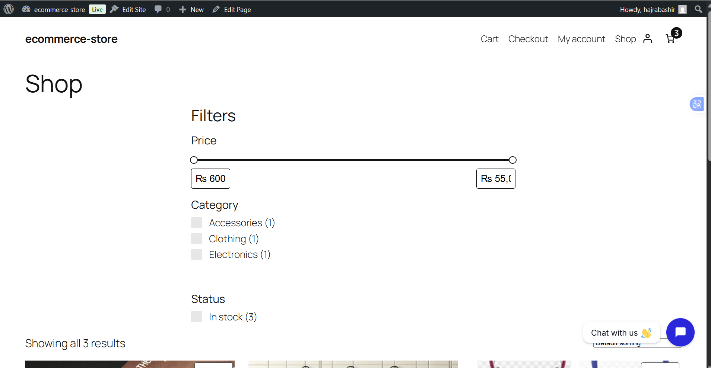
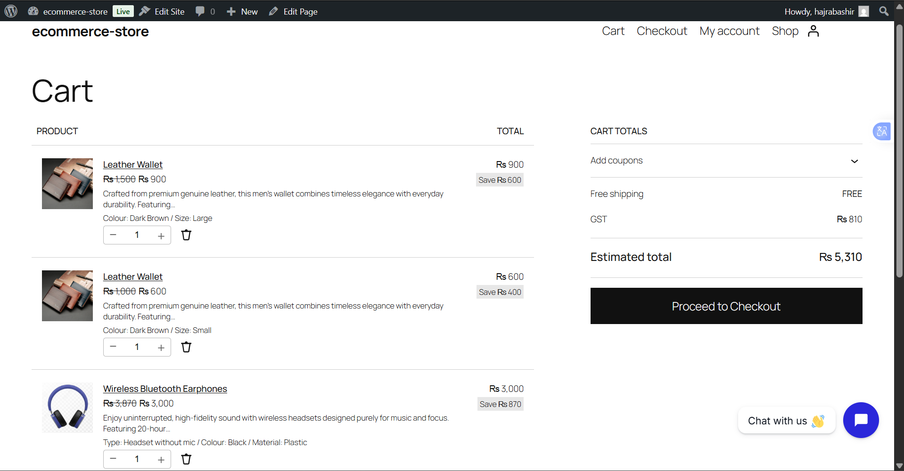
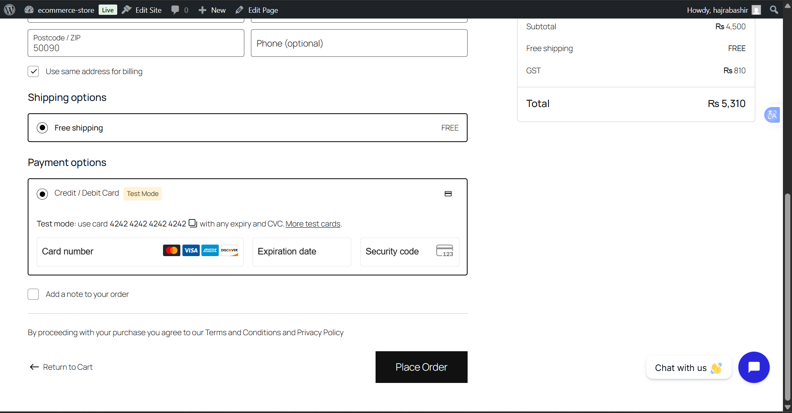
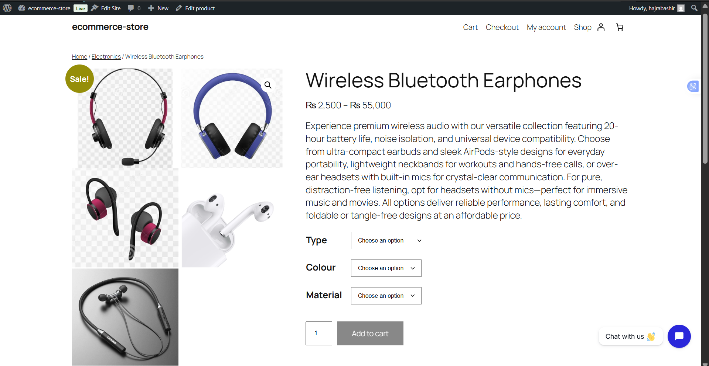
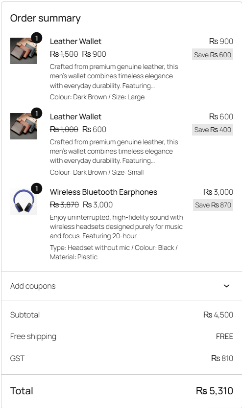

# WooCommerce Store
E-commerce website with AJAX filters, Stripe/PayPal payments, discounts, and live chat.
A fully functional e-commerce website built during my internship at Internee.pk.

## 🛒 Live Demo
| Shop Page with Filters | Cart with Discount |
|-----------------------|-------------------|
|  |  |

| Checkout Page | Live Chat |
|--------------|-----------|
|  |  |

| Earphones options | Tax Checkout |
|--------------|-----------|
|  |  |

## ✨ Features

- ✅ WooCommerce store setup
- ✅ AJAX product filters (Category, Price, Stock)
- ✅ Custom cart & checkout pages
- ✅ Stripe payment gateway integration
- ✅ JazzCash/EasyPaisa (Pakistan)
- ✅ Dynamic pricing & discounts (Buy 3 get 1 free, 10% off over $50)
- ✅ Live chat support (Tidio)
- ✅ Tax configuration (18% GST for Pakistan)
- ✅ Responsive design with Elementor

- ## 🛠️ Tech Stack

- WordPress + WooCommerce
- Elementor (Free)
- PHP, MySQL
- Stripe API
- Tidio Chat

## 📦 Products Added

| Product | Category | Price |
|---------|----------|-------|
| Premium Cotton T-Shirt | Clothing | Rs 3,999 |
| Wireless Bluetooth Earphones | Electronics | Rs 2,500 |
| Leather Wallet | Accessories | Rs 600 - Rs 900 |

## 🚀 Local Setup

1. Install [LocalWP](https://localwp.com/)
2. Create new WordPress site
3. Install WooCommerce + Elementor
4. Clone this repo into `/wp-content/themes/`
5. Activate theme in WordPress
6. Import products and configure payment gateways

## 📋 Testing

**Test payment:** Use Stripe test card `4242 4242 4242 4242`

## 📅 Status

✅ Complete
